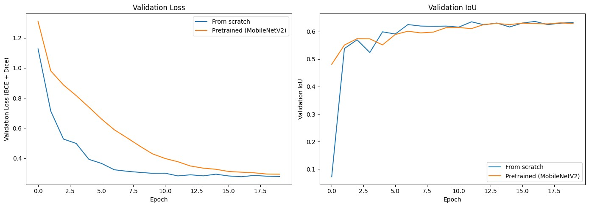
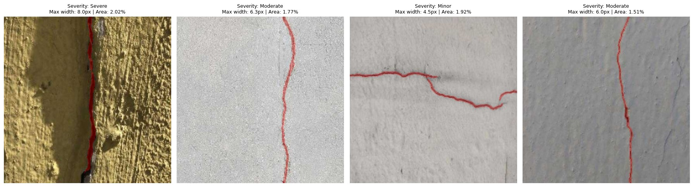
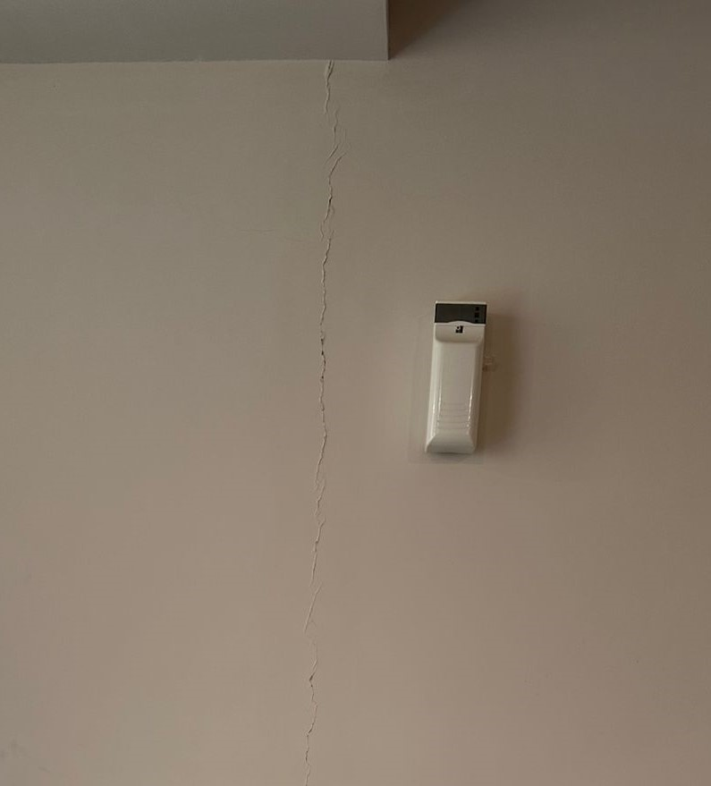

> **Concrete Crack Segmentation and Severity Estimation**

**Using U-Net: A Comparison of Random and Pretrained Encoder
Initialization**

Deep Learning Course Project

Mehtab Ahmed (PGD/DSAI/DEC-25/309192)

# Introduction

## Context

Concrete crack inspection in the built environment is still largely
performed by a trained inspector visually examining a surface and
recording a subjective judgement of severity. This approach is reliable
at small scale but does not scale efficiently across large property
portfolios, and it produces judgements that are difficult to compare
consistently across inspectors, time, or sites. Computer vision offers a
way to convert a visual inspection into a repeatable, quantitative
measurement rather than a one-off subjective call.

## Research Gap

Most publicly available crack-detection work addresses one of two
narrower problems: binary classification (crack present or not) or
bounding-box object detection. Neither output directly supports a
severity judgement, since neither measures the geometry of the crack
itself. Pixel-level segmentation, combined with a geometric
post-processing step that converts the mask into a width and coverage
measurement, is comparatively less common in openly available
course-level implementations, despite being the more natural fit: cracks
are irregular, connected regions rather than discrete, separately
countable objects, which segmentation represents more faithfully than
detection does.

## Aim of the Study

This project has three aims: (1) build and train two U-Net segmentation
models that are identical except for encoder initialization, one with
randomly initialized weights and one with an ImageNet-pretrained
MobileNetV2 encoder, in order to isolate and measure the effect of
transfer learning on this task; (2) design a post-processing pipeline
that converts a predicted crack mask into a quantitative severity tier
using skeletonization and distance-transform-based width measurement;
and (3) evaluate the resulting pipeline both on held-out data from the
training distribution and on an independently captured photograph, to
test how well the system generalizes beyond the dataset it was trained
on.

# Materials and Methods

## Study Objects and Materials

The Crack Segmentation Dataset, distributed via Roboflow and accessed
through Ultralytics' built-in dataset configuration, was used for all
training and evaluation. The dataset consists of close-up photographs of
cracked concrete and pavement surfaces, with a single annotated class
(crack), originally labelled as polygon outlines. The working split used
in this project consisted of 3,717 training images and 200 validation
images.

## Data Preparation

Polygon annotations were rasterized into single-channel binary masks
(255 = crack, 0 = background) using OpenCV, since the segmentation
architecture used requires pixel masks rather than polygon coordinates.
Images were resized to 224×224 pixels using bilinear interpolation;
masks were resized using nearest-neighbour interpolation to avoid
introducing fractional, non-binary values at mask edges. All pixel
values were normalized to the \[0, 1\] range before being passed to the
model.

## Study Design

A two-arm comparative design was used. Both arms share an identical
U-Net decoder and an identical encoder depth and skip-connection
structure (five resolution stages: 224, 112, 56, 28, 14, and a 7×7
bottleneck). The only difference between arms is the encoder's starting
weights:

- **Model A (From Scratch):** a plain convolutional encoder with
  randomly initialized (Glorot) weights.

- **Model B (Transfer Learning):** a MobileNetV2 encoder pretrained on
  ImageNet (14,482,497 total parameters; 14,445,761 trainable), with all
  layers left trainable and fine-tuned jointly with the decoder from the
  first epoch.

Both models were trained on the same data, with the same augmentation,
loss function, optimizer, and epoch budget, so that any difference in
outcome is attributable to the encoder initialization rather than a
confound elsewhere in the pipeline.

## Interventions

Both models were trained using the Adam optimizer (learning rate
1×10-4), a batch size of 16, for up to 20 epochs. The
20-epoch cap was set to fit the computing time available on Google Colab
rather than being triggered by the early-stopping callback (patience of
8 epochs on validation IoU) configured for the run; this distinction is
addressed further in the Limitations section. A learning-rate reduction
callback (factor 0.5, patience 4 epochs on validation IoU) was also
used. To reduce overfitting on a moderately sized dataset, training
images (but not validation images) were augmented with random horizontal
and vertical flips, random 90-degree rotations, and random
brightness/contrast jitter, with identical geometric transforms applied
to each image and its corresponding mask to keep labels aligned.

## Methods of Measurement and Calculation

Segmentation quality was measured using a combined Binary Cross-Entropy
and Dice loss, chosen because crack pixels form a small minority of each
image and a plain cross-entropy loss is prone to being dominated by the
background class. Model performance was reported using the Dice
coefficient, Intersection over Union (IoU), and binary pixel accuracy on
the held-out validation set.

Severity was estimated from each predicted mask in two steps. First, the
mask was reduced to a one-pixel-wide skeleton (its morphological
centreline), and a Euclidean distance transform was used to measure the
local width of the crack at each point along that skeleton, giving a
maximum crack width and mean crack width in pixels, alongside the
percentage of the image occupied by crack pixels. Second, these
per-image measurements were converted into a three-tier severity label
(Minor, Moderate, Severe) using cutoffs set at the 33rd and 66th
percentiles of the maximum-width distribution observed across the
validation set. These cutoffs are therefore relative to this dataset and
camera setup, not calibrated to a physical millimetre standard, since no
camera calibration data (fixed distance or reference object of known
size) was available for this dataset.

## Statistical Analysis

Final validation metrics for both models were compared descriptively on
the same held-out set. Descriptive statistics (mean, standard deviation,
and quartiles) were computed for the crack-width and area-coverage
distributions used to derive the severity cutoffs. No formal
significance testing was performed, as each model configuration was
trained once rather than across multiple random seeds; this is
acknowledged explicitly as a limitation in Section 4.4.

# Results

## Segmentation Performance Comparison

Table 1 reports final validation metrics for both models after 20 epochs
of training. Contrary to expectation, the from-scratch model matched or
marginally exceeded the pretrained model on every metric measured.

| **Metric**        | **From Scratch** | **Pretrained (MobileNetV2)** |
|-------------------|------------------|------------------------------|
| Loss (BCE + Dice) | 0.278            | 0.296                        |
| Dice Coefficient  | 0.759            | 0.742                        |
| IoU               | 0.637            | 0.632                        |
| Binary Accuracy   | 0.9909           | 0.9904                       |

*Table 1. Final validation metrics for both models after 20 training
epochs.*

Figure 1 shows validation loss and validation IoU across training. The
pretrained model began training with a substantially higher IoU
(approximately 0.48 at epoch 0) than the from-scratch model
(approximately 0.07), consistent with the expectation that pretrained
features provide a useful head start. However, the from-scratch model's
IoU rose sharply within the first two epochs and overtook the pretrained
model shortly afterward; from that point on, the two curves track
closely, with the from-scratch model holding a small, consistent lead
through to epoch 20. The loss curves show a similar pattern in reverse.

>  style="width:6.4in;height:2.25774in" />

*Figure 1. Validation loss (left) and validation IoU (right) across 20
training epochs, from-scratch model vs. pretrained (MobileNetV2) model.*

## Severity Quantification

Running the pretrained model over all 200 validation images produced a
detectable crack mask in every image (200 of 200), consistent with the
dataset containing only crack-positive images. From the resulting
maximum-width distribution, severity cutoffs were set at 5.66 px
(Minor/Moderate boundary) and 7.21 px (Moderate/Severe boundary). Table
2 summarizes the underlying distribution.

| **Statistic**   | **Max Width (px)** | **Area Coverage (%)** |
|-----------------|--------------------|-----------------------|
| Mean            | 6.98               | 2.23                  |
| Std. Dev.       | 2.74               | 1.01                  |
| Minimum         | 4.00               | 0.70                  |
| 25th percentile | 4.47               | 1.62                  |
| Median          | 6.00               | 1.93                  |
| 75th percentile | 8.25               | 2.51                  |
| Maximum         | 20.88              | 8.23                  |

*Table 2. Descriptive statistics of maximum crack width and area
coverage across 200 validation images (n = 200, all with a detected
crack).*

Applying these cutoffs to the same 200 images produced a severity
distribution of 78 Severe, 70 Moderate, and 52 Minor cases, summing to
the full validation set. Because every validation image contained a
labelled crack, this evaluation does not include any true-negative
(crack-free) surface, a point returned to in Section

4.4.

## Qualitative Segmentation and Severity Output

Figure 2 shows the end-to-end pipeline output (predicted mask overlay,
maximum width, area coverage, and severity label) on four validation
images spanning different surface colours and textures. The predicted
mask visibly follows the crack's irregular path in each case, and the
resulting severity labels are consistent with the width cutoffs
established in Section 3.2 (all four widths fall close to the 5.66 px
and 7.21 px boundaries, explaining the mix of Minor, Moderate, and
Severe labels shown).

>  style="width:6.4in;height:1.73147in" />

*Figure 2. Pipeline output on four validation images of varying surface
texture and colour, showing the predicted crack mask (red overlay) and
resulting severity classification.*

## Generalization to an Independently Captured Photograph

As an exploratory test of generalization beyond the training
distribution, a photograph of an actual wall crack, captured
independently of the dataset, was submitted to the trained pipeline. In
its original wide, full-room framing, the model reported no crack
detected (0.0 px maximum width, 0.00% area coverage), despite a crack
being clearly visible to a human viewer. The same crack, photographed
with a tighter crop so that it occupied a larger proportion of the
frame, was correctly detected and classified as Minor severity. Figure 3
shows the cropped photograph used in the successful detection.

>  style="width:3.25597in;height:3.6in" />

*Figure 3. Independently captured photograph of a hairline wall crack,
cropped tightly; correctly detected and classified as Minor severity by
the trained pipeline. The same crack, in its original wide framing, was
not detected (see Section 4.3 for discussion).*

# Discussion

## Statement of Main Result

The main result of this project is that, within the tested 20-epoch
budget, the from-scratch U-Net matched or marginally outperformed the
ImageNet-pretrained MobileNetV2 U-Net on every validation metric (Dice,
IoU, loss, and accuracy). This runs counter to the hypothesis motivating
the study design, namely that a pretrained encoder would provide a
measurable advantage over random initialization.

## Expected vs. Observed Results

The training curves in Figure 1 show that the pretrained model's early
advantage was real: at epoch 0, before any task-specific training had
occurred, it already achieved a validation IoU roughly seven times
higher than the from-scratch model, confirming that the pretrained
features were indeed informative from the start. What was not expected
was that this advantage narrowed and reversed within the first few
epochs of training, rather than persisting or widening as training
continued. This makes the result more specific and more interesting than
a simple "transfer learning did not help" conclusion: transfer learning
provided a clear initial benefit that was subsequently lost during
training.

## Comparison with Existing Literature and Explanation

The broader transfer-learning literature generally reports that
pretrained encoders outperform randomly initialized ones, particularly
on datasets of this size (a few thousand images). The result observed
here is therefore more consistent with a specific, identifiable
methodological cause than with a genuine limitation of transfer learning
for this task. The most likely explanation is the fine-tuning schedule
used: the pretrained encoder was left fully trainable and fine-tuned
jointly with a randomly initialized decoder from the very first training
step. Early in training, a randomly initialized decoder produces large,
noisy gradients as it has not yet learned anything useful; because these
gradients propagate back through the entire network, they can disturb or
partially overwrite the pretrained encoder's features before the decoder
has stabilized enough to make good use of them. This phenomenon is
documented in the transfer-learning literature and is the reason a
staged fine-tuning schedule, freezing the encoder while the decoder
trains for several initial epochs, then unfreezing the encoder at a
reduced learning rate, is commonly recommended rather than fine-tuning
the full network from epoch one. That staged schedule was not
implemented in this project, and its absence is the most plausible
explanation for the observed result. Separately, the compressed 20-epoch
training budget (Section 2.4) may not have given the pretrained model
sufficient time to recover from this early disruption, even with the
learning-rate reduction callback in place.

The wider use of segmentation-based, rather than purely detection-based,
approaches to convert visual crack data into a severity judgement is
consistent with concurrent work applying deep learning to multi-level
crack severity classification in civil engineering inspection contexts,
supporting the general framing adopted in this project even though the
specific transfer-learning result obtained here diverges from what that
broader literature would predict.

## Limitations

- **Training budget:** both models were capped at 20 epochs due to
  available compute time on Google Colab, rather than being trained to
  convergence via the early-stopping callback. The validation curves
  appear to be flattening by the final epochs, but early stopping was
  not formally triggered, so full convergence cannot be confirmed.

- **Single training run per configuration:** each model configuration
  was trained once. No repeated runs across different random seeds were
  performed, so the observed from-scratch advantage cannot be
  statistically distinguished from run-to-run variance with the data
  currently available.

- **No true-negative evaluation:** all 200 validation images contained a
  labelled crack, so the model's false-positive rate on genuinely
  crack-free surfaces was not measured in this evaluation.

- **Uncalibrated severity units:** severity cutoffs are defined relative
  to the pixel-width distribution of this validation set, not calibrated
  to a physical millimetre standard, since no camera-distance or
  reference-object calibration data was available.

- **Scale-dependent detection failure:** the independent photograph test
  in Section 3.4 shows that a real crack, clearly visible to a human
  observer, was missed when captured in a wide, full-room frame, most
  likely because resizing the full image down to the model's 224×224
  input resolution reduced the crack to a sub-pixel width before the
  model ever processed it. The same crack was correctly detected once
  cropped tightly. This indicates a resolution and capture-distance
  limitation rather than a failure to recognize crack morphology in
  general.

- **Single combined mask per image:** the U-Net architecture used
  produces one mask per image rather than separating individual,
  distinct cracks the way an instance-segmentation approach would; two
  nearby but separate cracks would currently be reported as a single
  connected region.

## Generalizability

The qualitative results in Section 3.3 suggest the model generalizes
reasonably well within the domain it was trained on, close-up
photographs of concrete or pavement surfaces, across a range of surface
colours and textures. Generalization outside that domain is currently
weaker, as demonstrated directly in Section 3.4: a photograph of an
interior painted wall, captured from typical room-scale distance rather
than as a close-up, was missed entirely, while the same crack captured
at a closer distance was correctly identified. In practical terms, this
suggests the current model is best suited to photographs deliberately
captured close to the surface of interest, and that generalizing to
arbitrary, unconstrained photographs would likely require either
additional training data representative of those conditions, or a
pre-processing step (such as tiling a wide photograph into closer-range
sections before inference) to keep cracks at a resolvable scale.

## Conclusions

This project produced a complete, working pipeline that takes a raw
photograph, segments any visible crack at the pixel level, measures its
geometry, and assigns an interpretable severity label, built and trained
within a constrained compute and time budget. The specific benefit
expected from transfer learning was not observed in this run; the
from-scratch model performed marginally better on every quantitative
metric. The evidence gathered (in particular the pretrained model's
strong initial IoU followed by a reversal early in training) points to
the joint, unstaged fine-tuning schedule as the most likely cause, a
fixable methodological choice rather than evidence that pretrained
features are unhelpful for this task. The severity-quantification layer
adds genuine interpretability beyond a plain detection output,
converting a mask into a number that can be tracked, compared, and
audited over time, though its current scope is explicitly relative
rather than calibrated to physical units, and its reliability depends on
the photograph being captured at a scale similar to the training data.
Addressing the domain-shift and calibration limitations identified here
would be the logical next step before this pipeline could be considered
for any real inspection use.
